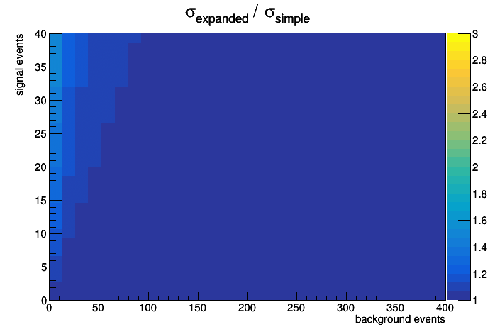

# StatisticsCode

- significance and different (approximate) formulas
- Stewart-Tackmann method for uncertainty evaluation. See https://arxiv.org/abs/1107.2117 for reference

Study of significance formulas

